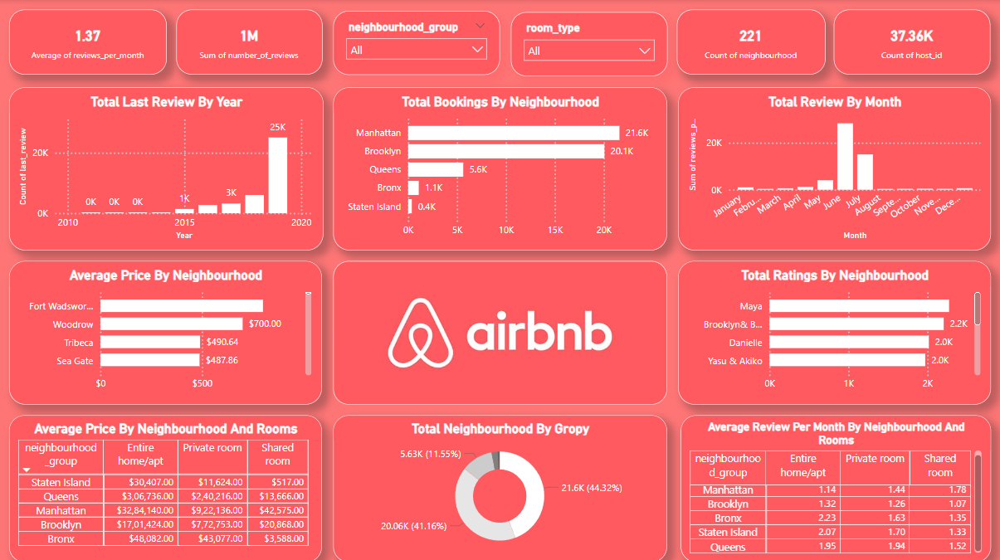

# Airbnb Data Analysis Dashboard (Power BI)

## Project Overview
Designed and developed a comprehensive Power BI dashboard to analyze Airbnb data for New York City. Created interactive visualizations including bar charts, line graphs, and maps to display booking trends, pricing data, and neighborhood statistics. Implemented slicers and filters for dynamic data exploration by neighborhood and room type.
### Data Source
The data for this project was sourced from [Kaggle: New York City Airbnb Open Data](https://www.kaggle.com/datasets/dgomonov/new-york-city-airbnb-open-data).
### Dashboard Overview: 
## Tools & Technologies Used
- Power BI

## Key Features
- **Interactive Visualizations**: Includes bar charts, line graphs, and maps to effectively display data on booking trends, pricing, and neighborhood statistics.
- **Dynamic Data Exploration**: Slicers and filters allow users to explore data dynamically by neighborhood and room type.
- **Actionable Insights**: Provided insights on booking patterns, pricing strategies, and customer satisfaction across NYC boroughs.

